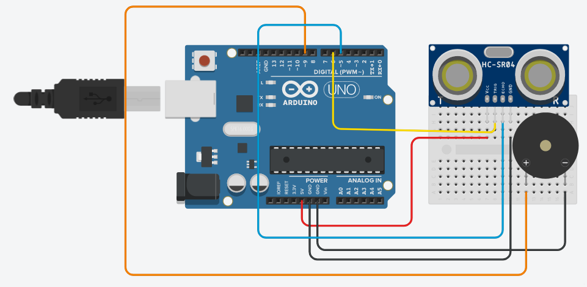

# Como contruir

### Itens necessarios

#### Hardware

| Materiais              | Especificações | Descrições |
|:-----------------------|:---------------|:--------------------------:|
| 1X Arduino             | Uno R3 ou Nano | A plataforma Arduino facilitará a utilização de microcontroladores. É recomendado utilizar as verções Uno R3 ou Nano devido a facilidade e o tamanho. |
| 1X Buzzer                | 3.3V ou 5V       | Um pequeno emissor de som. |
| 1X Capacitor             | 330 - 1000 µF    | (Opicional) Dará um pequeno efeito no som do buzzer. |
| 1X Sensor Ultrassônico   | HC-SR04          | Utilizado para medir distâncias |
| 1X Adaptador de bateria  | 9V (recomendado) | Servirá de fonte de alimentação para o projeto |

#### Software

| Programas | Descrição |
|:----------|:---------:|
| Arduino IDE | Será usado para editar e fazer o upload do código para dentro do arduino |
| Código fonte do projeto | Para baixa-lo basta clicar [aqui](https://github.com/Samuel-de-Oliveira/Helen/releases) e escolher a versão `Helen_HC_SR04.tar.gz` |

### Como montar

Abaixo temos a imagem do esquema feito no tinkercad, logo basta segui-lo como está.

> :information_source: Se você deseja utilizar o capacitor basta colocalo entre as porta `9` e o `gnd` do arduino e o terminal negativo e positivo do buzzer.

> :information_source: Esse é osquema do projeto, a implementação dele, ou seja, se você quer fazer um boné adpatado ou ma pulsera fica ao seu criterio (Pode ser literalmente qualquer coisa que você quiser).

### Compilação e configuração do código
